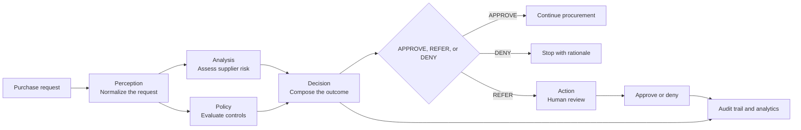
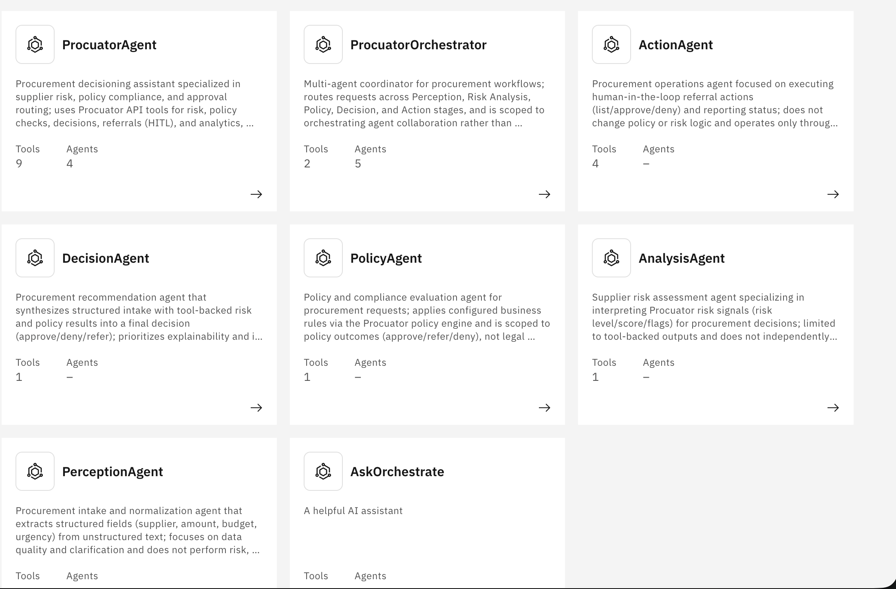
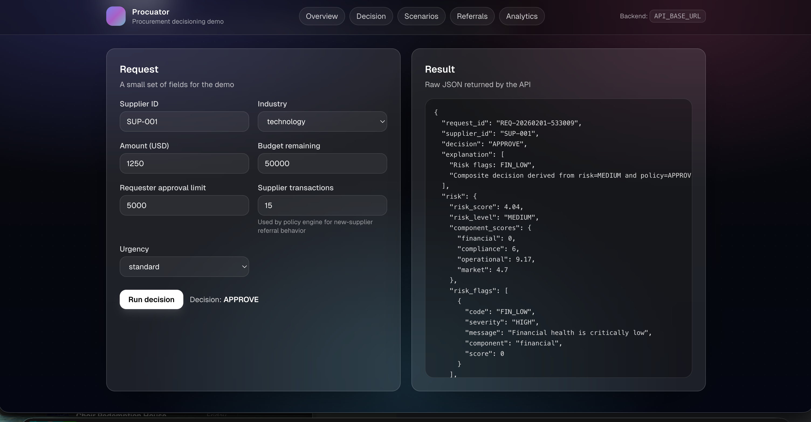
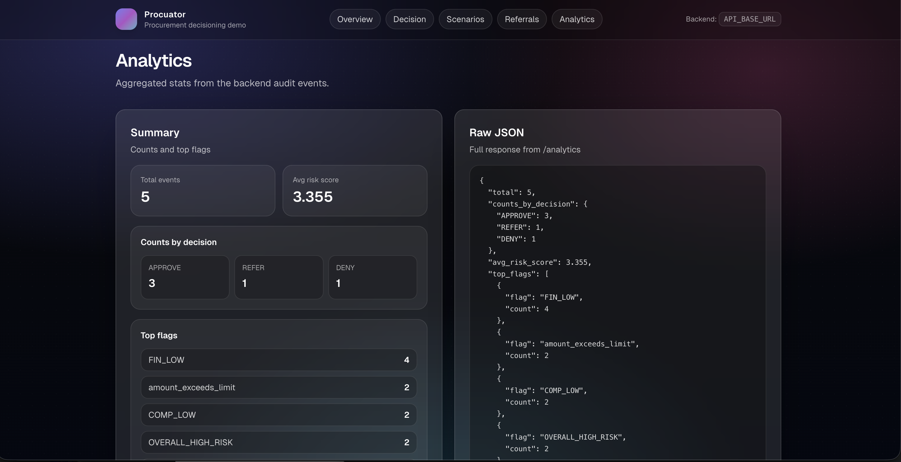

# Procuator

**Policy-grounded procurement decisions on IBM watsonx Orchestrate.**

Procuator is an autonomous procurement decisioning reference implementation. It turns a purchase request into an explainable `APPROVE`, `REFER`, or `DENY` outcome by combining supplier risk signals with encoded organizational policy.

The system automates routine approvals, stops requests that violate hard controls, and escalates ambiguous or high-risk cases to a human approver. Every decision includes its policy flags, risk evidence, rationale, and audit event.

> Autonomous where policy permits. Human-led where judgment is required.

[Watch the full demo](procurate-orchestrate.mp4) · [Explore the architecture](architecture.md) · [Inspect the Orchestrate assets](apps/api/assets/orchestrate)


## The problem

Procurement approvals often depend on information spread across supplier records, budgets, authority matrices, and policy documents. Reviewers repeatedly reconstruct the same context, low-risk requests wait in queues, and the reasoning behind a decision is difficult to audit.

Procuator makes that decision path explicit and executable:

- standard requests can proceed without avoidable manual handling;
- policy breaches are declined consistently;
- exceptions are routed to the correct approval level;
- decision evidence is retained for review and analytics.

## How a request is decided



The [watsonx Orchestrate flow](apps/api/assets/orchestrate/procurement_decision_flow.yml) separates the workflow into five focused agents:

| Agent | Responsibility |
| --- | --- |
| **Perception** | Extract and normalize supplier, amount, budget, authority, history, and urgency fields. |
| **Analysis** | Interpret tool-backed supplier risk scores and flags. |
| **Policy** | Apply encoded procurement rules without changing risk logic. |
| **Decision** | Combine risk and policy results into an explainable recommendation. |
| **Action** | Manage human-in-the-loop referrals and report their status. |

The orchestrator coordinates those agents while the API tools remain the source of truth for calculations and decisions. This keeps probabilistic agent behavior separate from deterministic business controls.

## Decision signals

The proof of concept is explicit about which signals are operational today and which belong to the product roadmap.

| Signal | Current behavior | Status |
| --- | --- | --- |
| **Vendor history** | Uses prior transaction count to distinguish new and established suppliers. | Implemented |
| **Supplier risk** | Produces financial, compliance, operational, and market component scores with flags. | Implemented |
| **Budget coverage** | Denies a request when its amount exceeds the remaining budget. | Implemented |
| **Approval authority** | Refers requests above the requester's approval limit to a manager or director. | Implemented |
| **Urgency** | Applies the encoded critical-request override without bypassing the budget control. | Implemented |
| **Pricing drift** | Intended to compare current unit pricing with contract, quote, or purchase-order history. It is not yet evaluated by this proof of concept. | Integration point |

The runtime uses three machine-readable outcomes:

| Outcome | Meaning |
| --- | --- |
| `APPROVE` | The request is within policy and accepted risk tolerances. |
| `REFER` | A human approver must resolve an authority, supplier-history, or risk exception. |
| `DENY` | A hard control failed, such as an invalid amount or insufficient budget. |

In product language, `REFER` is the escalation path and `DENY` is the decline path.

## Built for IBM watsonx Orchestrate

Procuator includes importable [IBM watsonx Orchestrate](https://www.ibm.com/products/watsonx-orchestrate/multi-agent-orchestration) assets rather than treating orchestration as a presentation-layer concept:

- a [multi-agent orchestrator specification](apps/api/assets/orchestrate/procuator_orchestrator.yml);
- five [specialist agent specifications](apps/api/assets/orchestrate/agents);
- a deterministic [procurement decision flow](apps/api/assets/orchestrate/procurement_decision_flow.yml);
- nine reusable [Python tools](apps/api/assets/orchestrate/tools/python) that call the Procuator API;
- an [import helper](apps/api/assets/orchestrate/import_agents.sh) that loads tools, collaborators, and the orchestrator in dependency order.



For local Orchestrate Developer Edition, set `PROCUATOR_API_BASE_URL=http://docker.host.internal:8000` so containerized tools can reach the API. With the Orchestrate ADK configured, import the assets with:

```bash
./apps/api/assets/orchestrate/import_agents.sh
```

## Repository evidence

The implementation is organized around independently testable responsibilities.

| Capability | Primary artifact |
| --- | --- |
| API composition and routing | [`Application.py`](apps/api/src/procuator/api/Application.py) and [`ApiController.py`](apps/api/src/procuator/api/ApiController.py) |
| Supplier risk assessment | [`SupplierRiskChecker.py`](apps/api/src/procuator/features/risk/SupplierRiskChecker.py) |
| Encoded procurement policy | [`PolicyEngine.py`](apps/api/src/procuator/features/policy/PolicyEngine.py) |
| Composite decision rules | [`DecisionRules.py`](apps/api/src/procuator/features/decision/DecisionRules.py) |
| Decision orchestration | [`DecisionService.py`](apps/api/src/procuator/features/decision/DecisionService.py) |
| Human referrals | [`ReferralService.py`](apps/api/src/procuator/features/decision/ReferralService.py) |
| Audit and analytics | [`DecisionAuditor.py`](apps/api/src/procuator/features/decision/DecisionAuditor.py) |
| Repeatable demo cases | [`DemoScenarios.py`](apps/api/src/procuator/features/demo/DemoScenarios.py) |
| Automated verification | [`apps/api/tests`](apps/api/tests) |
| IBM Cloud deployment | [Code Engine workflow](.github/workflows/deploy-code-engine.yml) |

## Demo walkthrough

Start the complete stack:

```bash
docker compose up --build
```

Then open:

- web experience: [http://127.0.0.1:3000](http://127.0.0.1:3000)
- API documentation: [http://127.0.0.1:8000/docs](http://127.0.0.1:8000/docs)

A concise reviewer walkthrough takes about three minutes:

1. Open **Scenarios** and load one of the three repeatable procurement cases.
2. Open **Decision**, submit the request, and inspect its outcome, flags, and explanation.
3. For a `REFER` result, open **Referrals** and approve or deny the exception.
4. Open **Analytics** to review decision counts and the most frequent flags.
5. Compare the local result with the same tool-backed flow in watsonx Orchestrate.

| Decision workspace | Decision analytics |
| --- | --- |
|  |  |

Additional views: [overview](docs/screenshots/overview.png) · [demo scenarios](docs/screenshots/scenario.png)

## Run locally

### Docker

Docker Compose starts the FastAPI service and Next.js application together:

```bash
docker compose up --build
```

### Development

Procuator requires Python 3.11+ and Node.js 20+.

Prepare the API:

```bash
python -m venv .venv
source .venv/bin/activate
pip install -e 'apps/api[dev]'
```

Start both development servers:

```bash
./scripts/dev.sh
```

Alternatively, run them independently:

```bash
# Terminal 1
cd apps/api
uvicorn procuator.api.Application:app --host 127.0.0.1 --port 8000 --reload

# Terminal 2, from the repository root
npm --prefix apps/web ci
npm --prefix apps/web run dev
```

The web application uses `http://127.0.0.1:8000` by default. Set `API_BASE_URL` to point it at a different API deployment.

## API surface

| Endpoint | Purpose |
| --- | --- |
| `GET /health` | Service health and version |
| `GET /demo/scenarios` | Repeatable demonstration cases |
| `POST /risk-check` | Supplier risk assessment |
| `POST /policy-check` | Procurement policy evaluation |
| `POST /decision` | Full risk, policy, decision, referral, and audit workflow |
| `GET /referrals` | Pending human reviews |
| `POST /referrals/{id}/approve` | Approve a referred request |
| `POST /referrals/{id}/deny` | Deny a referred request |
| `GET /analytics` | Structured decision analytics |
| `GET /dashboard` | Lightweight HTML analytics dashboard |

The installed Python package also provides a `procuator` CLI:

```bash
procuator risk-check SUP-001 --industry technology
procuator demo-scenarios
procuator decide SUP-009 \
  --industry technology \
  --amount 15000 \
  --budget-remaining 50000 \
  --requester-approval-limit 5000 \
  --supplier-transactions 0
procuator generate-data --output data/procurement_test_data.json --count 10
```

## Project structure

```text
.
├── apps
│   ├── api
│   │   ├── assets/orchestrate    # agents, flow, tools, and import helper
│   │   ├── src/procuator
│   │   │   ├── api               # HTTP transport and composition
│   │   │   ├── cli               # command-line interface
│   │   │   ├── core              # shared contracts and settings
│   │   │   └── features          # risk, policy, decision, and demo modules
│   │   └── tests
│   └── web                       # Next.js reviewer experience
├── docs/screenshots              # visual project evidence
├── scripts                       # local developer automation
└── .github/workflows             # CI and IBM Cloud deployment
```

## Validation

Run the focused project checks from the repository root:

```bash
pytest -q apps/api/tests
ruff check apps/api/src apps/api/tests
ruff format --check apps/api/src apps/api/tests
npm --prefix apps/web run lint
npm --prefix apps/web run build
```

Container and workflow definitions are available in [`apps/api/Dockerfile`](apps/api/Dockerfile), [`apps/web/Dockerfile`](apps/web/Dockerfile), and [`.github/workflows`](.github/workflows).

## Proof-of-concept boundaries

The repository demonstrates the complete decision lifecycle, but production adoption would require:

- durable referral and audit storage instead of in-memory state and local JSONL;
- identity, role-based access, and separation-of-duties controls;
- versioned policy authoring with review and change approval;
- governed integrations for supplier master data, sanctions, contracts, purchase orders, and pricing history;
- provenance, freshness, and failure handling for every external signal;
- operational monitoring, security hardening, and retention policies.

## Documentation

- [Architecture](architecture.md)
- [Workflow](workflow.md)
- [Engineering notes](engineering.md)
- [Full demonstration video](procurate-orchestrate.mp4)
